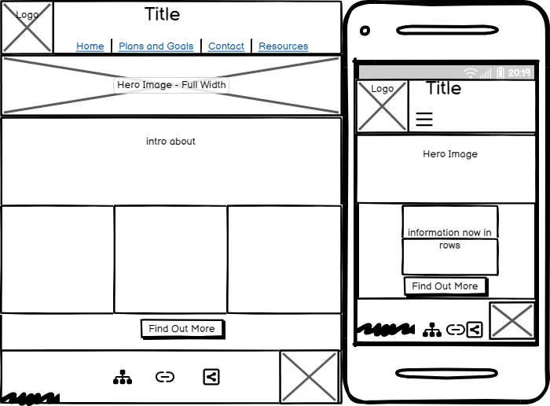
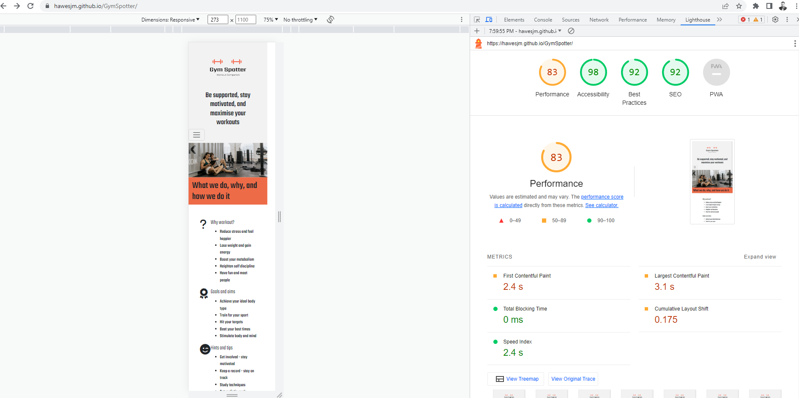

# Gym Spotter
## Table Of Contents
1. **Introduction**
   
2. **Structure**
* Architecture
* UX Design
* Navigation
  
3. **Design**
* Colour Scheme
* Typography
* Imagery
* Wireframes
  
4. **Limitations**
   
5. **Features**
* Existing Features
* To Be Added
  
6. **Technologies**
   
7. **Testing**
* Strategy
* Initial Bugs
* Testing Methodology
* Testing Reports
  
8. **Deployment**
   
9. **Usage**
    
10. **Collaboration**
    
11. **Acknowledgments**
    
12. **Further Development**
    
13. **Final Notes**

14. **Appendix**

### Introduction
Gym Spotter is a web application designed to aid the individual user to develop and maintain a desired exercise routine in order to set and achieve specific fitness aims and life goals. To do this it aims to help users assess their body type, set realistic fitness targets with this in mind, and plan accordingly with the most efficient strategy and techniques for them. Gym Spotter also aims to support the user by introducing the concept of a community of individuals with shared goals, as sharing their progress within a likeminded peer group of individuals with similar time constrains or struggles helps build accountability and maintain motivation. Gym Spotter also aims to underpin this heightened knowledge and sharpened motivation by providing users with a wealth of tips and external resources to find the best workout regime for them. In so doing Gym Spotter aims to be a focal point of a conscientious and content fitness and lifestyle minded community that firstly offers advice and resources tailored to the individual, and secondly never loses sight of the sense fun and camaraderie offered by sports and exercise that keeps people engaged and motivated in their workouts.

See Apendix for User Stories

The concept was developed for the purpose of completing the first Milestone Project for the Code Institute's Full Stack Developer course. It was built to express the knowledge and skills gained from the HTML, CSS and User Centric Design modules.

The live website can be found here https://hawesjm.github.io/GymSpotter/

### Structure
##### Architecture
Gym Spotter is built using pure HTML5 and CSS according to the principles of creating a responsive and accessible static front-end user-centric website. Bootstrap and media queries were also used to ensure responsive design.

##### User Experience Design
For first time visitors I imagined the user first of all wanting to know the best way to get started working out in an appropriate way, and quickly access a starting framework for sustainable progress and remaining motivated. For returning users I wanted to begin developing a framework where they can continually assess their progress according to an easily defined roadmap and measure their achievements against certain external standards. In both cases I wanted clear and easily navigable content on desktop, tablet and also mobile device so users can effectively achieve their goals while working out or while taking some rest in their downtime.
##### Navigation
All Pages will contain a Navigation menu at the top of the Webpage that directs them to a new Page to easily allow users to Navigate the site easily. The Nav Menu will be collapsible on a Mobile device to make use of space on smaller devices. The homepage will give a brief introduction to the purpose of the site itself. "Plans and Goals" will provide users with the basic information to get started. "Contact and Social" will help users to stay on track through positive engagement and accountability. "External Resources" will provide paths for users to enhance and develop their workout plans and lifestyle according to the principles introduced in previous sections.

Across all devices and screen sizes the layout will remain clean and the flow of information will progress logically, enhanced at certain points by CTAs. All pages will contain a footer with social media contact links for further engagement. Certain elements on each page will respond interactively to help users move through the information flow of the site.

### Design
##### Colour Scheme
The main background colour is Grey , with a darker shade for certain areas of focus or calls to action. This aims to echo the industrial colour scheme popular with a lot of urban gyms. The main accent colour is Orange  which provides excellent contrast and elevates the Grey tones with an energetic, modern feel. Occasionally a light Blue is used to further this.
##### Typography
The main font used is Teko to enhance the modern industrial feel of the website with provision for using Roboto when this is necessary for further clarity.
##### Imagery
The Gym Spotter logo is displayed in the header and footer of all pages, and on all devices and screensizes. The exact placement, positioning and sizing of the logo will change depending on the screen size. The website also displays images for general motivation or to help clarify specific sections of information.
##### Wireframes
###### Homepage

###### Plans and Goals

###### Contact and Social

###### Partners and External Resources

###### Differences
Needed more space appropriate descriptive elements on Plans and Goals page for mobile. Slight changes to logo position for different screen sizes.
### Limitations
Due to no JavaScript functionality, apart from Bootstrap(JS/JQuery) there is no contact form that will store data or send email requests. Also for this reason the intended individual workout plans cannot be created.

### Features
##### Existing Features
- CTA button on home page
- Responsive table with workout plans
- Responsive contact form with fields and slider
- Responsive Google maps iframe
- Responsive testimonials carousel

##### To Be Added
- Member login area and forum
- Form clearing function

### Technologies
- **HTML**
This project uses HTML as the main language used to complete the structure of the Website.
- **CSS**
This project uses custom written CSS to style the Website.
- **Bootstrap**
The Bootstrap framework is used throughout this website for layouts and styling.
This has also been used to import JavaScript/Query where necessary
- **Font Awesome**
Font awesome Icons are used in the Body of the site and for the Social media links contained in the Footer section of the website.
- **Google Fonts**
Google fonts are used throughout the project to import the Teko and Roboto fonts
- **Code Anywhere**
The IDE for writing the code, using CI approved template
- **GitHub**
GithHub is the hosting site used to store the source code for the Website and Git Pages is used for the deployment of the live site.
- **Google Chrome Developer Tools**
Google chromes built in developer tools are used to inspect page elements and help debug issues with the site layout and test different CSS styles.
- **Balsamiq Wireframes**
This was used to create wireframes for 'The Skeleton Plane' stage of UX design.
 - **place-hold.it**
place-hold.it was used to display the colours shown in the Color Scheme section.

### Testing

##### Strategy
As this project is static and contains no back-end functionality, the testing performed will be on the visual effects and layout of the Website including navbars, buttons and links.

No elements should overlap another container div. All elements should remain on the screen at all sizes above 300px. All carousel items should be controllable with the mouse as well as sliding on a timer.

All nav links should direct to the correct html pages as per their names. The Home page is the exception, this one will redirect to index.html.

All links to external websites must open in a new browser.

Testing of form validation will also be required to ensure the correct inputs are taken and that all fields are required.

##### Initial Bugs
Index html columns not centered. Solved with media query and margin left.
Text size for columns won't increase for larger screen sizes, too small. Solved with media query.
Hamburger menu not working on mobile, due to bootstrap class error, wrong target property.
Form columns bootstrap – changed div class from “form-row” to “row”. Alignment issue solved with margin auto.
Testimonial text size for mobile – solved by media query.

All other bugs related to positioning and sizing of flexbox elements or bootrstrap columns, e.g. with the Google Maps iframe as below eventually solved by giving parent div fixed height and width properties before styling accordingly.

##### Testing Methodology
video at testing/2023-07-07 00-04-43.mkv

As a First Time user, I want to easily understand the main purpose of the site and learn more about the organisation. - Testing was performed to ensure sufficient information was displayed on the Home Page.

As a First Time user, I want to be able to easily navigate throughout the site to find content. - Testing was performed on all Navigation links to ensure users can easily navigate the Website.

As a First Time user, I want to view the website and content clearly on my mobile device. - Testing was performed to ensure the Website was responsive on all devices.

As a First Time user, I want to find ways to follow the Gym Spotter on different social media platforms. - Testing was performed to ensure Social Media links had been added to the Website.

As a Returning user, I want to enter my details so the organisation could respond with relevant information. - Testing was done to ensure there was a contact form on the Website.

As a Frequent user, I want to check local resources. - Testing was done to ensure the map displayed properly on all devices.

As a Frequent user, I want to check to see how active and involved Gym Spotter is in the fitness community. - Testing was done to ensure the partners section was clear and responsive.

##### Testing Report

Full testing results can be found here testing/gym-spotter-testing.xlsx
Please note these results are a .xlsx file and will require excel, google docs or compatiable program to open the file.
Related images:

Additionally, all pages were run through the W3C HTML Validator.

Finally, the css file was uploaded to and run through the W3 CSS Validator.

### Deployment
Deployed to GitHub pages via "Main" branch using the "pages build and deployment" workflow.

To run locally:
Navigate to the GitHub Repository
Click the Code drop down menu.
Either Download the ZIP file, unpackage locally and open with IDE (This route ends here) OR Copy Git URL from the HTTPS dialogue box.
Open your development editor of choice and open a terminal window in a directory of your choice.
Use the 'git clone' command in terminal followed by the copied git URL.
A clone of the project will be created locally on your machine.

### Usage
The page is publicly available at https://hawesjm.github.io/GymSpotter/ for users to access freely and navigate accordingly. No login details necessary to fully navigate the site and browse the information contained therein.

### Collaboration
All collaboration welcome to enhance the UX of the site through the development of back end support that tracks and logs the information of people filling in the contact form section of the site.

### Acknowledgments
I'd like to thank my Code Institute assigned mentor Daisy McGirr for her support and input, as well as Matt Bodden for his initial thoughts at the beginning of the project.

### Further Development
It is my intention that GymSpotter becomes the initial part of a larger series of related projects to create an interactive fitness community. As such no code is to be copied or shared externally without express permission.

#### Final Notes
The Partners section is purely for reference only and is not intended to indicate or suggest legitimate business links between the companies mentioned and GymSpotter, which is purely a fictional entity created for the purposes of this project under the course framework of DIWAD_MS1.

#### Appendix 1 - User Stories

#### Appendix 2 - Development Lifecycle

##### Iteration 1, Homepage

- Inception: the user is looking for a responsive website for information on how to start working out more effectively and with more support.
- Task: the development team to create a landing page with the site's purpose, basic information and CTA button clearly visible, below the general navigation bar. Internal navigation links are all to be checked.
- Increment: once responsiveness, accessibility and links (internal and external for social) are confirmed the initial homepage including navbar and CTA features are to be commited for deployment.

##### Iteration 2, Plans and Goals

- Inception: the user then uses the site to find more specific information related to their body type that they can use to inform themselves about and for their future workout, including an example schedule.
- Task: the development team is to present this differing, specific information in a clear, accessible and responsive way. Images with sufficient resolution are to be used to resonate with the user and prompt progression to other site pages in the navigation bar.
- Increment: once responsiveness, accessibility, links, image resolution, design contrast, and broad information relevance are all confirmed, the page is to be commited for deployment.

##### Iteration 3, Contact and Social

- Inception: the user, having found relevant information, is now looking for support through their fitness journey and will be interested to become part of a wider like-minded community, sharing their information and receiving validation from other users.
- Task: the development team is to allow for this by creating a contact form for users to enter the details, supported by relevant testimonials from other users. Both are to be responsive allowing users to enhance their involvement with the web application on different devices.
- Increment: once responsiveness for screen size as well as responsivity to relevant user input (including thank you page on submission) are confirmed, accessibility is to be assessed and then the page is to be committed for deployment.

##### Iteration 4, Partners and External Resources

- Inception: the user, having found relevant information, and having found a community of like-minded fitness enthusiasts, will want to explore other relevant information related to but not necessarily included in the scope of this application.
- Task: the development team is to provide a brief, compelling and responsive framework for the user to explore said external resources in a manner consistent with the feel and expectations created by the application so far.
- Increment: once responsiveness for screen size, particularly as it relates to image resolution (example use and indicative partners) and the Google Maps plugin frame, is confirmed and all internal and external links are checked the page is to be committed for deployment.

##### Iteration 5, Maintenance and Future Releases

- Inception: as the user relies on the application for relevant information, a like-minded community, and relevant external resources, the user will expect the site to be regularly updated to remain connected and relevant as their desires and goals change.
- Task: the development team is to provide scope for the future implementation of new features including an email contact form for specific requests, responsive workout plan functionality, and a live map for relevant events.
- Increment: the intention for maintenance and expansion is to be detailed by the development team in the web application documentation.
